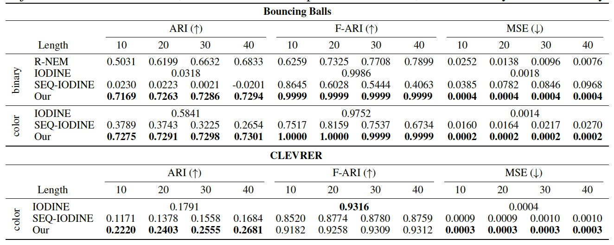

This is the code repository complementing the paper "PROVIDE: A Probabilistic Framework for Unsupervised Video Decompositi".  The pretrained models are included in the repo.


GIF showing results for CLEVRER dataset       |  Scene Decomposition Experiment
:-------------------------:|:-------------------------:
 |  

## Dependencies and Setup

- scikit_image==0.16.2
- ipdb==0.12.2
- opencv_python==4.2.0.32
- imageio==2.6.1
- torchvision==0.4.0a0+9232c4a
- h5py==2.7.1
- numpy==1.18.0
- torch==1.2.0
- matplotlib==2.1.2
- visdom==0.1.8.9
- moviepy==1.0.3
- Pillow==7.1.2
- scikit_learn==0.23.0
- skimage==0.0
- tensorboardX==2.0


## Experiments

### Datasets

#### Bouncing Balls
- Please download the Bouncing Balls datasets 'balls4mass64.h5' and 'balls678
mass64.h5' from oficial R-NEM[2] [website](https://github.com/sjoerdvansteenkiste/Relational-NEM).
- Run the scripts (bb_binary.py, bb_binary678.py, bb_colored.py, bb_colored678.py and bb_colored678_4_colors.py) from the same directory where the .h5 files are. Like this:
```bash
python bb_binary.py 
```
It might take a while.

#### CLEVRER
- Train split, validation split and validation annotations should be obtained from the official CLEVRER [website](http://clevrer.csail.mit.edu/)[3]. We use the validation set as test set, because the test set does not contain annotations. Please unzip everything you download.
- For testing, we trim the videos to a subsequence containing at least 3 objects and object motion. We compute these subsequences by running the script (slice_videos_from_annotations.py in the attached code) from the folder with the validation split and validation annotations.
```bash
python slice_videos_from_annotations.py
```
- The test set ground truth masks can be downloaded from [here](https://drive.google.com/file/d/1dRnBKRJXsEyKe0EaNq3SHK1KMiJOv71v/view). The masks and the preprocessed test videos will be grouped into separate folders based on the number of objects in a video.
- To finish the dataset preparation please run the clevrer.py from the directory where the downloaded train data is. And run the clevrer_test.py and clevrer_masks_test.py from the directory where is the output of slice_videos_from_annotations.py together with the downloaded unzipped masks.


### Test
You will need at least one GPU to run tests. We used GeForce GTX 10 series GPU. For the Python version we had Python 3.6.9. Use the following commands to test the models:
 
- Bouncing Balls 4 balls/binary
```bash
python scripts/test.py --batch_size 1 --datapath /path/to/bb_binary/  --gt_datapath /path/to/bb_color --model_name bb_binary --T 6  --K 5
```
Here and everywhere below use the flag --max_num_frames to set the number of frames per video. Default is 30.

For enabling the frame prediction please use the --predict_frames flag followed by the desired number of predicted frames.

Also please make sure that you prepared both bb_binary and bb_color for this experiment if you want to compute the scores. bb_color is the GT for bb_binary. If you don't want to compute the scores and just want to visualise results then you can set the --gt_datapath to /path/to/bb_binary/.

If you want to visualise the outputs or generate latents walks add the batch numbers to batch_to_print and batch_to_print_latent in the test.py.

- Bouncing Balls  4 balls/colored

```bash
python scripts/test.py --batch_size 1 --datapath /path/to/bb_color/  --gt_datapath /path/to/bb_color --model_name bb_color --T 6  --K 5
```

- Bouncing Balls  4-8 balls/binary
```bash
python scripts/test.py --batch_size 1 --datapath /path/to/bb_binary678/ --gt_datapath /path/to/bb_color678/ --model_name bb_binary --T 6  --K 9 --max_num_frames 10
```

- Bouncing Balls  4-8 balls/colored/ colors
```bash
python scripts/test.py --batch_size 1 --datapath /path/to/bb_color678/ --gt_datapath /path/to/bb_color678/ --model_name bb_color --T 6  --K 9 --max_num_frames 10
```
- Bouncing Balls  4-8 balls/colored/4 colors
```bash
python scripts/test.py --batch_size 1 --datapath /path/to/bb_color678_4_colors/ --gt_datapath /path/to/bb_color678/ --model_name bb_color --T 6  --K 9 --max_num_frames 10
```

- CLEVRER 3-5 objects
```bash
python scripts/test.py --batch_size 1 --datapath /path/to/clevrer345/ --gt_datapath /path/to/clevrer345masks/ --model_name clevrer --T 5  --K 6
```
- CLEVRER 6 objects
```bash
python scripts/test.py --batch_size 1 --datapath /path/to/clevrer6/ --gt_datapath /path/to/clevrer6masks/ --model_name clevrer --T 5  --K 6
```


### Train

For training models we used 8 GeForce GTX 10 series GPUs.

- Bouncing balls binary
```bash
python scripts/train.py --batch_size 32 --max_num_frames 4 --datapath /path/to/bb_binary/ --model_name bb_binary --T 6  --K 5
```
- Bouncing balls color
```bash
python scripts/train.py --batch_size 32 --max_num_frames 4 --param_schedule --datapath /path/to/bb_color/ --model_name bb_color_train --T 6  --K 5
```

- CLEVRER
```bash
python scripts/train.py --batch_size 32 --max_num_frames 4 --param_schedule --datapath /path/to/clevrer/ --gt_datapath /path/to/clevrer/ --model_name clevrer --T 5  --K 6
```


## Acknowledgements

We thank Michael Kelly for allowing us to use his [implementation](https://github.com/MichaelKevinKelly/IODINE) of the IODINE[1] paper that has served as a backbone for developing this model.


## References

 1. Greff, K., Kaufmann, R.L., Kabra, R., Watters, N., Burgess, C., Zoran, D., Matthey, L., Botvinick, M., Lerchner,  A.:  Multi-object representation learning with iterative variational inference. https://arxiv.org/pdf/1903.00450.pdf. 
  
 2. Van Steenkiste, S., Chang, M., Greff, K., Schmidhuber, J.: Relational neural expectation maximization: Unsupervised discovery of objects and their interactions. https://arxiv.org/pdf/1802.10353.pdf.
        
 3. Yi, K., Gan, C., Li, Y., Kohli, P., Wu, J., Torralba, A., Tenenbaum, J.B.: Clevrer: Collision events for video representation  and reasoning. https://arxiv.org/pdf/1910.01442.pdf.

